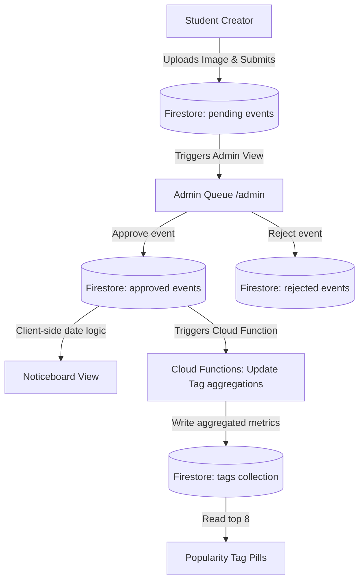

# 📌 FlockIn!! — Your Campus Connected

[](https://vitejs.dev/)
[](https://react.dev/)
[](https://www.typescriptlang.org/)
[](https://tailwindcss.com/)
[](https://firebase.google.com/)

**FlockIn!!** is a vibrant campus event discovery platform designed to connect university students with events, clubs, and resources. Inspired by the physical, buzzing corkboard at a student union center, FlockIn!! serves as a tactile digital noticeboard where students can discover what's happening on campus in under 30 seconds.

---

---

## 🎨 Visual Identity & Brand Personality

FlockIn!! rejects bland enterprise styling and cold corporate UI in favor of a warm, tactile, and electric experience:
- **The Noticeboard**: Events are displayed as paper posters pinned with colorful pushpins (red, yellow, teal) onto a dark green felt board background.
- **Organic Layout**: Each card features a slight random tilt (`-3deg` to `+3deg`) seeded deterministically by the event ID, giving the board a physical noticeboard feel.
- **Micro-interactions**: Hovering over a poster straightens it, lifts it off the board (using smooth scale and shadow transitions), and presents a quick action overlay.
- **Brand Palette**: Styled with **Terracotta** accents, warm pastel blobs for background depth, and bold **Montserrat** typography.

---

## 🚀 Key Features

### 1. Tactile Virtual Noticeboard
*   **Masonry Layout**: Preserves the natural aspect ratio of each poster.
*   **Stable Seeded Rotation**: Posters maintain their rotation across re-renders to prevent jarring visual shifts.
*   **Fallback Gradients**: If an event lacks an image, it auto-generates a gorgeous, deterministic color gradient seeded by the event ID.

### 2. Multi-Select Hashtag Filters
*   **Popularity-Ranked Pills**: An interactive tag bar shows active tags ordered dynamically by engagement scores.
*   **System Tags**: Auto-applied `#Today` and `#Happening Now` tags update client-side using helper datetime calculations.
*   **Multi-Select Stacking**: Stack tags (e.g., `#Free` + `#Social`) to narrow down search results instantaneously.

### 3. Moderation & Safety Pipeline
*   **Admin Review Queue**: All newly created events go into a `pending` state and must be reviewed and approved by the admin before appearing on the public noticeboard.
*   **Rate Limiting**: Users are restricted to a maximum of 3 event posts per day.
*   **Flag/Report Flow**: Users can report events, which flags them in Firestore for review.

### 4. Personal Dashboard ("My Space")
*   **My Events**: Track created events and view their status (`Pending Review`, `Approved`, or `Rejected`).
*   **Saved & Going**: Track saved bookmarks (🔖) and RSVP responses (✅) with count states syncing in real-time.

### 5. Responsive Bottom Tab Bar
*   An adaptive UI layout that transitions the left sidebar into a thumb-friendly bottom tab bar on mobile screens (≤768px).

---

## 🛠 Tech Stack

- **Frontend**: [React 18](https://reactjs.org/), [TypeScript](https://www.typescriptlang.org/), [Vite](https://vitejs.dev/)
- **Styling & Components**: [Tailwind CSS](https://tailwindcss.com/), [shadcn/ui](https://ui.shadcn.com/), [Radix UI primitives](https://www.radix-ui.com/)
- **Backend & Database**:
  *   **Firestore**: Real-time NoSQL database utilizing aggregate collections and composite indexing.
  *   **Firebase Authentication**: Google Sign-In for secure student logins.
  *   **Firebase Storage**: File hosting with drag-and-drop media uploading.
  *   **Cloud Functions**: Node.js microservices for atomic aggregation transactions.

---

## 📊 System Architecture & Data Flow



---

## 💻 Getting Started

### 📋 Prerequisites
Ensure you have the following installed:
*   [Node.js](https://nodejs.org/) (v18.x or higher)
*   [Firebase CLI](https://firebase.google.com/docs/cli) (`npm install -g firebase-tools`)

### 📦 Installation

1.  **Clone the Repository**
    ```bash
    git clone https://github.com/Rahilyw/FlockIn.git
    cd FlockIn
    ```

2.  **Install Frontend Dependencies**
    ```bash
    npm install
    ```

3.  **Install Firebase Functions Dependencies**
    ```bash
    cd functions
    npm install
    cd ..
    ```

4.  **Configure Environment Variables**
    Copy `.env.example` to `.env.local` and populate it with your Firebase Web App configuration:
    ```bash
    cp .env.example .env.local
    ```
    Configure the variables in `.env.local`:
    ```ini
    VITE_FIREBASE_API_KEY=your-api-key
    VITE_FIREBASE_AUTH_DOMAIN=your-auth-domain
    VITE_FIREBASE_PROJECT_ID=your-project-id
    VITE_FIREBASE_STORAGE_BUCKET=your-storage-bucket
    VITE_FIREBASE_MESSAGING_SENDER_ID=your-sender-id
    VITE_FIREBASE_APP_ID=your-app-id
    VITE_FIREBASE_MEASUREMENT_ID=your-measurement-id
    
    # Gates the /admin route (found in Firebase Auth User List)
    VITE_ADMIN_UID=your-admin-user-uid
    ```

---

## ⚙️ Development & Database Seeding

To make development easier, local seeding scripts are provided to populate your Firestore and Firebase Storage instances.

*   **Run Development Server**
    ```bash
    npm run dev
    ```
    The site will be available at `http://localhost:5173`.

*   **Database Seeding**
    *   **Seed mock events and tags:**
        ```bash
        npm run seed
        ```
    *   **Perform a clean seed (clear existing collections first):**
        ```bash
        npm run seed:fresh
        ```
    *   **Dry-run poster asset uploading:**
        ```bash
        npm run posters:dry
        ```
    *   **Upload actual poster assets to Firebase Storage:**
        ```bash
        npm run posters
        ```

---

## 🔒 Security Rules & Function Deployment

FlockIn!! enforces strict authorization constraints on Firestore and Cloud Storage.

*   **Deploy Firestore Security Rules & Indexes**
    ```bash
    firebase deploy --only firestore
    ```

*   **Deploy Cloud Storage Rules**
    ```bash
    firebase deploy --only storage
    ```

*   **Deploy Firebase Cloud Functions**
    ```bash
    firebase deploy --only functions
    ```

---

## 📂 Project Structure

```
FlockIn/
├── .firebase/             # Firebase Local configuration
├── functions/             # Firebase Cloud Functions (TypeScript source)
│   ├── src/
│   │   └── index.ts       # Document triggers for tag aggregation
│   └── package.json
├── scripts/               # Database seeding and poster generation utilities
│   ├── seed.ts
│   └── upload-posters.ts
├── src/
│   ├── components/
│   │   ├── Noticeboard/   # Noticeboard wall & Poster Card overlay modules
│   │   ├── Dashboard/     # My Space dashboard tabs
│   │   ├── Admin/         # Gated Admin review queue
│   │   ├── Layout/        # Navbar & BottomTabBar components
│   │   └── ui/            # shadcn UI wrappers
│   ├── firebase/          # Firebase config setup & query layers
│   ├── hooks/             # Custom React Hooks (auth, admin, events)
│   ├── pages/             # App views (Noticeboard, Details, Space, Form)
│   ├── types/             # Shared TypeScript models
│   ├── App.tsx            # Routes configuration
│   ├── index.css          # Theme styles, custom variables & typography
│   └── main.tsx
├── firestore.rules        # Production DB access control
├── storage.rules          # Production Storage access control
├── firebase.json          # Firebase deployment settings
└── package.json
```
